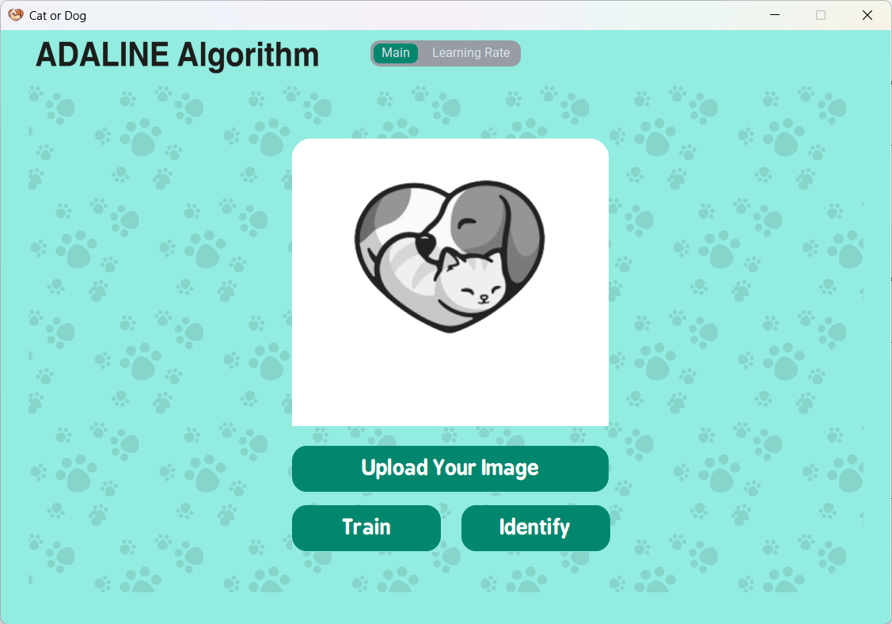
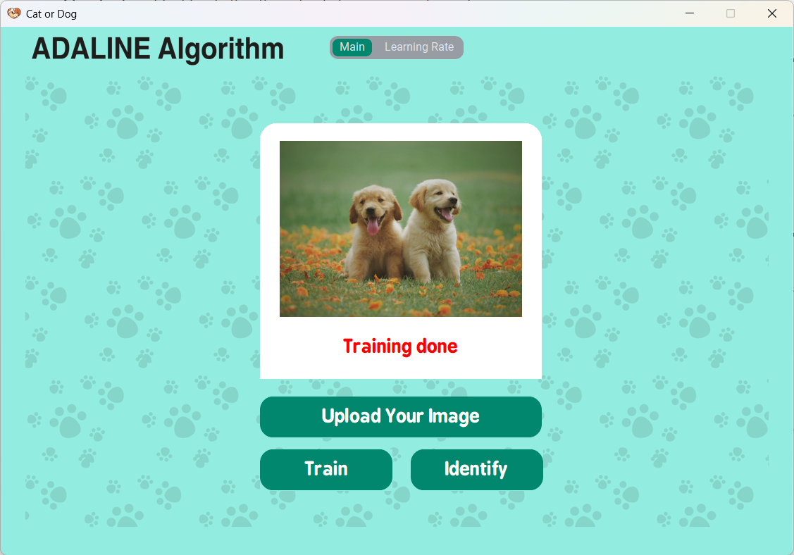

# Cat-or-Dog Classifier

This project is a **Cat-or-Dog Classifier** application with a Graphical User Interface (GUI) built using `customtkinter`. It allows users to upload an image, train a model, and classify whether the image is a cat or a dog.

---

##  Features

- **Image Upload**: Easily upload an image of a cat or dog for classification.  
- **Model Training**: Train the model using the **Adaline algorithm**.  
- **Classification**: Identify whether the uploaded image is a cat or a dog.  
- **Statistics Visualization**: View learning rate and training progress in the **Statistics** tab. 

---

##  Requirements

To run this project, ensure you have the following installed:

- Python `3.8` or higher
- Required Python libraries (install via `Requirements.txt`)

---

##  How to Run  the Project
- Clone the repo.
- Install dependencies: pip install -r Requirements.txt.
- Run the Gui.py file.

##  Steps in the GUI
- Click "Upload Your Image" to select an image.
- Click "Train" to train the model (if not already trained).
- Click "Identify" to classify the uploaded image.
- Finally, enjoy the sound of a cat or a dog! 😊

## GUI Screenshots

Here’s how the app looks:

### 1. Main Screen:

### 2. Train Screen:

### 3. Identify Screen:

### 4. Statistics Screen:

